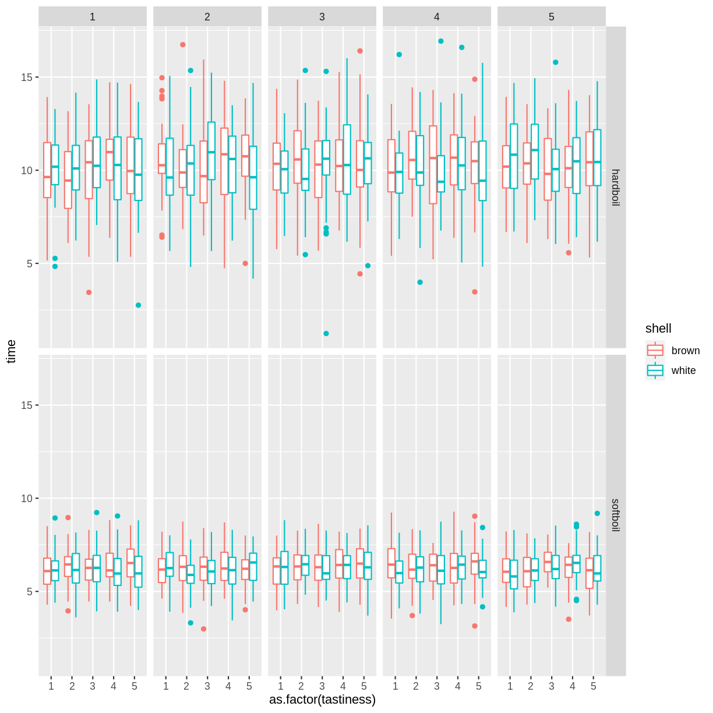

---
# Please do not edit this file directly; it is auto generated.
# Instead, please edit 06-rmd.md in _episodes_rmd/
title: "Reports with RMarkdown or "
teaching: 80
exercises: 35
questions:
  - "Why should you use RMarkdown to produce your manuscripts?"
  - "What are the advantages of using RMarkdown vs Word or LaTeX"
objectives:
   - "Become familiar with RMarkdown document structure"
   - "Use basic formating syntax"
   - "Learn to weave prose and code together"
keypoints:
   - "RMarkdown document change dynamically in response to changes in the data"
   - "RMarkdown lets you instantiate literally programming easily"
source: Rmd
---

# Acknowledgments

This lesson has been heavily influence by the Tobin Magle's presentation created for the [UW-Madison's Library Research Guides](https://researchguides.library.wisc.edu/R) entitled "Creating reproducible Research using R Markdown."

# Agenda {-}

1.  Why should you write your reports using RMarkdown?
2.  What is literate programming? Why is it useful?
3.  Scenario: Using R Markdown to

-   Format text
-   Embed code
-   Run Analyses
-   Create Tables
-   Create Plots

5.  Create your own document
6.  Ideas to organize your document 
7. Summary 
8. Where to find help

# Why you should write your reports using RMarkdown?

Rather than telling you why, I'm going to show you what the usual workflow for manuscript production in my field looks like. Then I'm going to show you what it looks like now that I have switched to writing exclusively in RMarkdown.

  1. collect data (interviews, recordings, corpora)
  2. code it into some type of data (tokens, measurements, categories)
  3. enter that into some computer software for analysis and visualizations
  4. write the prose in word processor  
  5. copy and paste the results from the analysis software
  6. import plots into the word processor
  7. changes in the data results into repeating steps 1-6

Sounds familiar? 
Can we do better?

## Anatomy of an RMarkdown document

# Literate programming

Human readable text + machine readable code = **reproducible** document

## Programs as work of literature

-   Idea by Donald Knuth, Stanford University.

-   A paradigm shift:

    -   **from** telling a computer what to do
    -   **to** telling a human what you want the computer to do

[Read More](http://www.literateprogramming.com/knuthweb.pdf)

## Literal Programming in Research

-   Tailor reports to an audience
-   Repeatable. Ensures reproducibility
-   Works well with version control
-   Works well with languages used in research.

## R, RStudio and RMarkdown

-   Weave your prose and code into one cohesive story

    -   R
    -   Python
    -   Stata
    -   SAS
    -   LaTeX

-   Produce document in many formats

-   Reproducible

# Scenario

**Setup** add \*\* Problem \*\* add \*\* Potential problems \*\*

## Doing it the Educated Pirate Way ARG!

1.  Install `markdown`, `bookdown`, `knitr` packages (script vs IDE)
2.  Install `tinytext` for pdfs
3.  Add to the YAML output: bookdown::pdf_document2: default
4.  Get the data
5.  Add some prose
6.  Weave some code into it to create a narrative
7.  Create a code chunk
8.  Create a table
9.  Create a plot

~~~
library(markdown)
library(bookdown)
library(knitr)
library(tidyverse)
~~~
{: .language-r}

~~~
── Attaching packages ─────────────────────────────────────── tidyverse 1.3.1 ──
~~~
{: .output}

~~~
✔ ggplot2 3.3.3     ✔ purrr   0.3.4
✔ tibble  3.1.1     ✔ dplyr   1.0.6
✔ tidyr   1.1.3     ✔ stringr 1.4.0
✔ readr   1.4.0     ✔ forcats 0.5.1
~~~
{: .output}

~~~
── Conflicts ────────────────────────────────────────── tidyverse_conflicts() ──
✖ dplyr::filter() masks stats::filter()
✖ dplyr::lag()    masks stats::lag()
~~~
{: .output}

~~~
beds <- read_csv(url("https://go.wisc.edu/r7c12n"))
~~~
{: .language-r}

~~~

── Column specification ────────────────────────────────────────────────────────
cols(
  hardboil = col_double(),
  softboil = col_double(),
  shell = col_character(),
  lid = col_character(),
  stove = col_character(),
  tastiness = col_double(),
  removal = col_double()
)
~~~
{: .output}

~~~
beds %>% group_by(shell, stove) %>% 
    summarize(mean = mean(hardboil))
~~~
{: .language-r}

~~~
`summarise()` has grouped output by 'shell'. You can override using the `.groups` argument.
~~~
{: .output}

~~~
# A tibble: 4 x 3
# Groups:   shell [2]
  shell stove     mean
  <chr> <chr>    <dbl>
1 brown electric 10.7 
2 brown gas       9.81
3 white electric 10.4 
4 white gas      10.1 
~~~
{: .output}

~~~
beds_long <- beds %>% 
  pivot_longer(cols = c(hardboil, softboil ), names_to = "cooking_method", values_to = "time")

beds_long %>% ggplot() +
  geom_boxplot(aes(y = time, x = as.factor(tastiness), color = shell)) +
  facet_grid(cooking_method~removal)
~~~
{: .language-r}

# Play with your document

-   Click *knit*
-   Alternatively, one can use the `render()` function

## What's happening behind the scenes?

# Create your own RMarkdown document

1.  download the `hardboiledegg` dataset

-   there is data about how long it takes to boil a egg (white shell vs brown shells), cooking method (hard vs soft), cooking method (covered vs uncovered), and gas vs electric stoves, and tastiness (1-5 scale less-more tastiness), ease of shell removal (1-5 scale easiest-hardest)

-   Write down a narrative in which play the role of a chef defensing how to best prepare hard boiled egg. Make you argument using data that supports your conclusion. Create a table that highlights your findings. Create an accompanying plot.

# Ideas to organize your reproducible document

-   Outline first, add code later
-   Use markdown syntax to structure and format your document \# headings \*\* **foldfacing**
-   [Check the cheatsheet](https://github.com/rstudio/cheatsheets/raw/master/rmarkdown-2.0.pdf)

# Summary

-   Literate programming makes reproducible research more machine readable

-   R markdown documents facilitate literate programming in RStudio

-   R markdown has 3 sections

    -   Header: determines output and adds parameters
    -   Markdown Text: can include inline code
    -   Code chunks: can be customized to mute code or output

# Need help?
