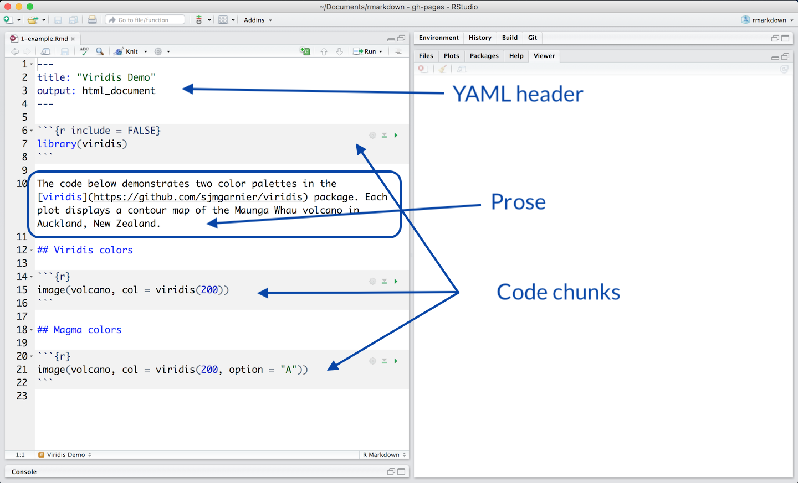
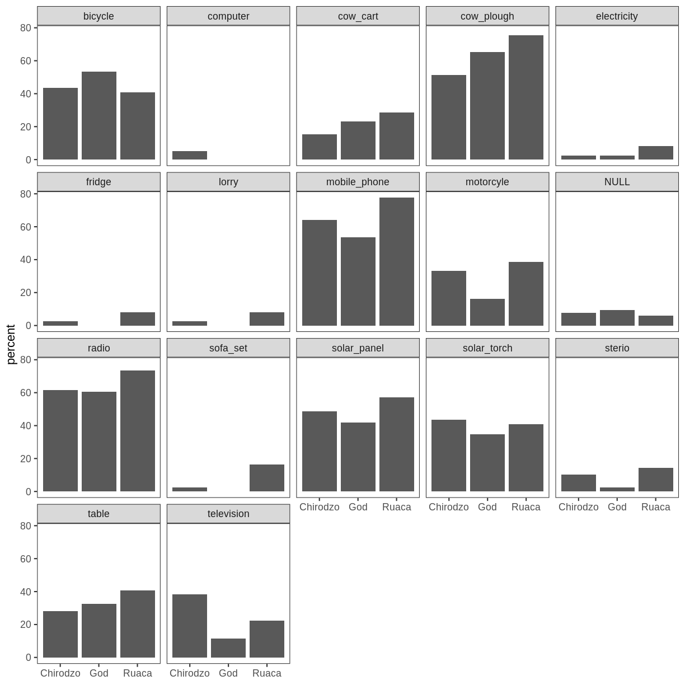
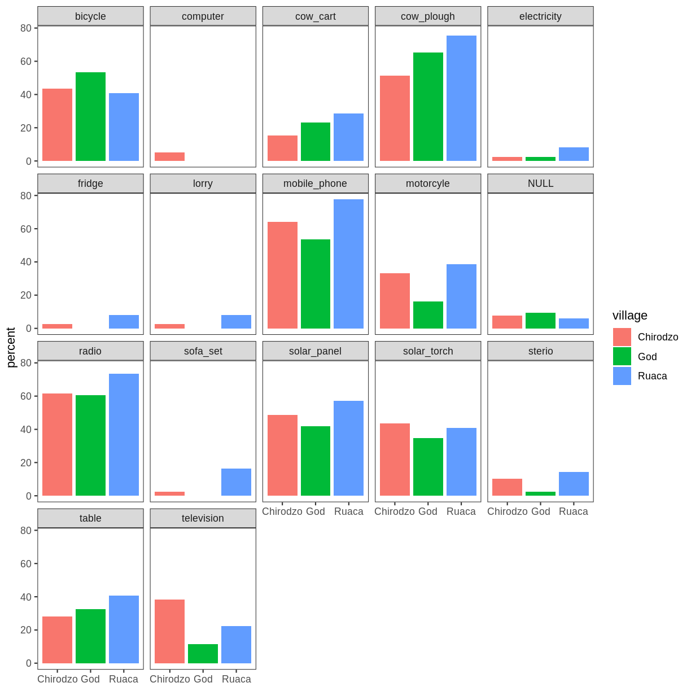

---
# Please do not edit this file directly; it is auto generated.
# Instead, please edit 06-rmd.md in _episodes_rmd/
title: "Reports with RMarkdown"
teaching: 80
exercises: 35
questions:
  - "Why should you use RMarkdown to produce your manuscripts?"
  - "What are the advantages of using RMarkdown vs Word or LaTeX"
objectives:
   - "Become familiar with RMarkdown document structure"
   - "Use basic formating syntax"
   - "Learn to weave prose and code together"
keypoints:
   - "RMarkdown document change dynamically in response to changes in the data"
   - "RMarkdown lets you instantiate literally programming easily"
source: Rmd
---

# Acknowledgments

This lesson has been heavily influence by the Tobin Magle's presentation created for the [UW-Madison's Library Research Guides](https://researchguides.library.wisc.edu/R) entitled "Creating reproducible Research using R Markdown."

# Agenda

1.  Why should you write your reports using RMarkdown?
2.  What is literate programming? Why is it useful?
3.  Scenario: Using R Markdown to
  -   Format text
  -   Embed code
  -   Run Analyses
  -   Create Tables
  -   Create Plots
5.  Create your own document
6.  Ideas to organize your document 
7. Summary 
8. Where to find help

# Why you should write your reports using RMarkdown?

Rather than telling you why, I'm going to show you what the usual workflow for manuscript production in my field looks like. Then I'm going to show you what it looks like now that I have switched to writing exclusively in RMarkdown.

  1. collect data (interviews, recordings, corpora)
  2. code it into some type of data (tokens, measurements, categories)
  3. enter that into some computer software for analysis and visualizations
  4. write the prose in word processor  
  5. copy and paste the results from the analysis software
  6. import plots into the word processor
  7. changes in the data results into repeating steps 1-6

Sounds familiar? 
Can we do better?

## Anatomy of an RMarkdown document

A typical RMarkdown document has three distinct parts: 

  1 - an (optional) YAML header surrounded by `---`.  
  2 - your prose (optionally) formatted using Markdown syntax. It also can include `inline code`.  
  3 - Code chunks containing your R script surrounded by 3 backticks.  
  

# Literate programming

Human readable text + machine readable code = **reproducible** document

## Programs as work of literature

-   Idea by Donald Knuth, Stanford University.
-   A paradigm shift:

    -   **from** telling a computer what to do
    -   **to** telling a human what you want the computer to do

[Read More](http://www.literateprogramming.com/knuthweb.pdf)

## Literal Programming in Research

-   Tailor reports to an audience
-   Repeatable. Ensures reproducibility
-   Works well with version control
-   Works well with languages used in research.

## R, RStudio and RMarkdown

-   Weave your prose and code into one cohesive story

    -   R
    -   Python
    -   Stata
    -   SAS
    -   LaTeX

-   Produce document in many formats

-   Reproducible

# Scenario

**SAFI** (Studying African Farmer-Led Irrigation) is a study looking at farming and irrigation methods in _Tanzania_ and _Mozambique_. The survey data was collected through interviews conducted between November 2016 and June 2017. For this lesson, we will be using a subset of the available data. For information about the full teaching dataset used in other lessons in this workshop, see the [dataset](https://datacarpentry.org/socialsci-workshop/data/) description.

##  Install the packages you'll need

~~~
library(markdown)
library(knitr)
library(tidyverse)
library(gt)
~~~
{: .language-r}

**Play with your document**
-   Click **knit**

##  Get the data

~~~
interviews_plotting <- read_csv(url("https://go.wisc.edu/5id64b"))

head(interviews_plotting)
~~~
{: .language-r}

~~~
# A tibble: 6 x 45
  key_ID village interview_date      no_membrs years_liv respondent_wall_… rooms
   <dbl> <chr>   <dttm>                  <dbl>     <dbl> <chr>             <dbl>
1      1 God     2016-11-17 00:00:00         3         4 muddaub               1
2      1 God     2016-11-17 00:00:00         7         9 muddaub               1
3      3 God     2016-11-17 00:00:00        10        15 burntbricks           1
4      4 God     2016-11-17 00:00:00         7         6 burntbricks           1
5      5 God     2016-11-17 00:00:00         7        40 burntbricks           1
6      6 God     2016-11-17 00:00:00         3         3 muddaub               1
# … with 38 more variables: memb_assoc <chr>, affect_conflicts <chr>,
#   liv_count <dbl>, no_meals <dbl>, instanceID <chr>, bicycle <lgl>,
#   television <lgl>, solar_panel <lgl>, table <lgl>, cow_cart <lgl>,
#   radio <lgl>, cow_plough <lgl>, solar_torch <lgl>, mobile_phone <lgl>,
#   motorcyle <lgl>, NULL <lgl>, fridge <lgl>, electricity <lgl>,
#   sofa_set <lgl>, lorry <lgl>, sterio <lgl>, computer <lgl>, car <lgl>,
#   Jan <lgl>, Sept <lgl>, Oct <lgl>, Nov <lgl>, Dec <lgl>, Feb <lgl>,
#   Mar <lgl>, Aug <lgl>, June <lgl>, July <lgl>, Apr <lgl>, May <lgl>,
#   none <lgl>, number_months_lack_food <dbl>, number_items <dbl>
~~~
{: .output}

##  Add some prose

The **SAFI** dataset contains data related to households and agriculture in _Tanzania_ and _Mozambique._ The survey covers things like:

- household features
- agricultural practices
- assets 
- details about the household members

**Play with your document!!!**
-   Click **knit**

##  Weave some code into it to create a narrative

Let's imagine we want write a paragraph about the population per village. Which village is the most populated? Is it _Chirodzo_, _God_, or _Ruaca_?  

### Create a table

~~~
interviews_plotting %>% select(village, no_membrs) %>% 
  group_by(village) %>%
  summarize(population = sum(no_membrs))  %>%
  gt() %>%
  tab_header(title = md("**Studying African Farmer-Led Irrigation**"),
            subtitle = md("Population _per village_"))
~~~
{: .language-r}

<!--html_preserve-->

<table class="gt_table">
  <thead class="gt_header">
    <tr>
      <th colspan="2" class="gt_heading gt_title gt_font_normal" style><strong>Studying African Farmer-Led Irrigation</strong></th>
    </tr>
    <tr>
      <th colspan="2" class="gt_heading gt_subtitle gt_font_normal gt_bottom_border" style>Population <em>per village</em></th>
    </tr>
  </thead>
  <thead class="gt_col_headings">
    <tr>
      <th class="gt_col_heading gt_columns_bottom_border gt_left" rowspan="1" colspan="1">village</th>
      <th class="gt_col_heading gt_columns_bottom_border gt_right" rowspan="1" colspan="1">population</th>
    </tr>
  </thead>
  <tbody class="gt_table_body">
    <tr><td class="gt_row gt_left">Chirodzo</td>
<td class="gt_row gt_right">276</td></tr>
    <tr><td class="gt_row gt_left">God</td>
<td class="gt_row gt_right">295</td></tr>
    <tr><td class="gt_row gt_left">Ruaca</td>
<td class="gt_row gt_right">371</td></tr>
  </tbody>
  
  
</table>

<!--/html_preserve-->

**Version A: prose with results manually added**  
Of the three villages surveyed, Ruaca is the most populated with 371 people. The second-most populated village is God with 295 people. The least populated village in the sample is Chirodzo with 276. 

> ## Note
> It would be ideal that the prose be responsive to the data we just produced! We can incorporate that into our document with inline code!
>
> First let's store our results in an object, then let's access the object to get the results we want. 
{: .callout}

**Version B: prose with results via inline code**  

~~~
pop_results <- interviews_plotting %>% 
  select(village,no_membrs) %>% 
  group_by(village) %>%
  summarize(population = sum(no_membrs)) 
~~~
{: .language-r}

Of the three villages surveyed, Ruaca is the most populated with 371 people.  

<pre>
The name of the village and the population total you see in the previous sentence weren't typed. They were extracted from the data we created using _inline code_. To get the name of the village with the most people, this code is needed &#96;rpop_results\$village[3]&#96;. To get the actual number of inhabitants, this code is needed &#96;r pop_results\$population[3]&#96;.
</pre>

> ## Add your own inline code
>
> Challenge. Modify the rest of the paragraph so that the rest of the villages and their population appear in the text. Remember that the data you need the R object is contained in the object `pop_result`.
>
> > ## Solution
> >
> > Of the three villages surveyed, Ruaca is the most
populated with 371 people. The second-most populated village is God with 295 people. The least populated village in the sample Chirodzo with 276.
> >
> {: .solution}
{: .challenge}

###  Create a plot

Imagine now that we want to get an idea of we want to get an idea of the type and number of items per house hold across all three villages. We can use what we learned in the ggplot lesson to create such a plot.

~~~
interviews_plotting %>% 
    group_by(village) %>%
    summarize(across(bicycle:computer, ~ sum(.x) / n() * 100)) %>% 
    pivot_longer(bicycle:computer, names_to = "items", values_to = "percent") %>% 
    ggplot(aes(x = village, y = percent)) +
    geom_bar(stat = "identity", position = "dodge") +
    facet_wrap(~ items) +
    theme_bw() +
    theme(panel.grid = element_blank(), axis.title.x = element_blank())
~~~
{: .language-r}

> ## Add some color 
>
> Challenge. Modify the code above so that the new barplots are color to reflect each village.
>
> > ## Solution
> > 
> > 
> > ~~~
> > interviews_plotting %>% 
> >     group_by(village) %>%
> >     summarize(across(bicycle:computer, ~ sum(.x) / n() * 100)) %>% 
> >     pivot_longer(bicycle:computer, names_to = "items", values_to = "percent") %>% 
> >     ggplot(aes(x = village, y = percent, fill = village)) +
> >     geom_bar(stat = "identity", position = "dodge") +
> >     facet_wrap(~ items) +
> >     theme_bw() +
> >     theme(panel.grid = element_blank(), axis.title.x = element_blank())
> > ~~~
> > {: .language-r}
> > 
> > 
> {: .solution}
{: .challenge}

## What's happening behind the scenes?

# Ideas to organize your reproducible document

-   Outline first, add code later
-   Use markdown syntax to structure and format your document \# headings \*\* **boldfacing**
-   [Check the cheatsheet](https://github.com/rstudio/cheatsheets/raw/master/rmarkdown-2.0.pdf)

# Summary
- Literate programming makes reproducible research more machine readable
- R markdown documents facilitate literate programming in RStudio
- R markdown has 3 sections
  -  Header: determines output and adds parameters
  -  Markdown Text: it can be lightly formatted and can include inline code too! 
  -  Code chunks: can be customized to mute code or output

# Need help?

- [Formating basics](https://rmarkdown.rstudio.com/authoring_basics.html)
- [Getting Started with R Markdown](https://rmarkdown.rstudio.com/index.html)
- [R Markdown: The Definite Guide](https://bookdown.org/yihui/rmarkdown/)
- [R Markdown Cookbook](https://bookdown.org/yihui/rmarkdown-cookbook/)
- [The Data Science Hub](https://datascience.wisc.edu/hub/)
